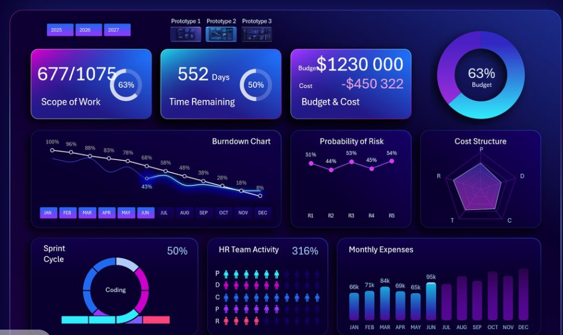

<h1 align="center">Deshna Bajaj</h1>

<h3 align="center">
Data Analyst
</h3>

I am a Data Analyst with 2+ years of experience in Financial Services Analytics and currently pursuing an M.Sc. in Big Data & Business Analytics in Germany.

My expertise includes Power BI, SQL, Python, and Business Intelligence, with a focus on transforming data into actionable business insights.

# Career Highlights

📊 Reduced manual reporting by 30%

⚡ Improved process efficiency by 20%

📈 Analyzed 426 S&P 500 companies

🤖 Built Machine Learning forecasting models

🌍 MSc Big Data & Business Analytics in Germany 

# Featured Projects

## ESG Score vs Financial Performance Analysis

Analyzed ESG and stock market data from 426 S&P 500 companies using Regression Analysis, K-Means Clustering, and PCA to evaluate the relationship between sustainability and financial performance.

## Power BI Superstore Dashboard
<table>
<tr>
<td width="50%">
  
Interactive dashboard analyzing sales, profitability, customer segments, and regional performance.

 

</td>

<td width="50%">

</td>

</tr>
</table>

## Technical Skills

# Contact

📧 [deshna.germany@gmail.com](mailto:deshna.germany@gmail.com)
[LinkedIn](YOUR_LINKEDIN_URL) • [GitHub](https://github.com/deshnainsights) • [Resume](Resume.pdf)
